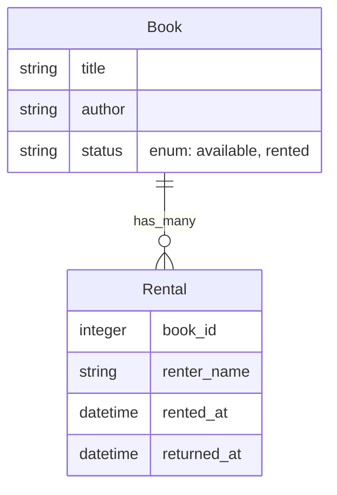

# Rails Developer Interview Task: Book Rental System

**Goal:** Build a simple Book Rental tracking system.

## Requirements

### 1. Data Models & Database
Create the necessary models and migrations with appropriate attributes.

**Suggested Schema:**

*   **Book**: Represents a book in the library.
*   **Rental**: Represents a rental transaction. A book can have many rentals (history), but only one *active* rental at a time.

### 2. Features

1.  **CRUD Operations**: Implement basic Create, Read, Update, Delete for `Book` and `Rental` models.
2.  **Dashboard (Root Path)**:
    *   Display a list of **all books**.
    *   For each book, display its **Status**:
        *   **Available**: The book is ready to be rented.
        *   **Rented**: The book is currently out.
    *   **Current Rental Info**: If a book is rented, display the current renter's name.
    *   **Stats**: Display a generic counter at the top showing the **Total Number of Books Currently Rented**.
